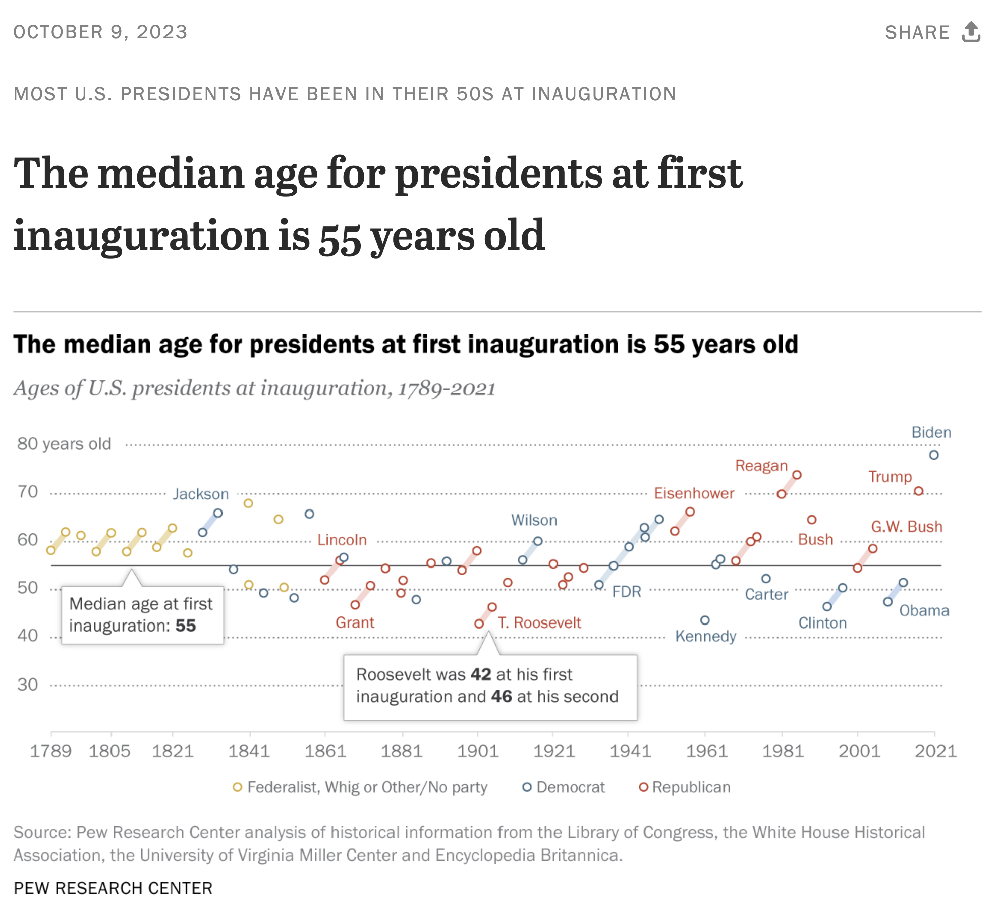

# Age of U.S. Presidents

This repository contains code in R to replicate the following graphic:

  

## Source

- Title: **Most U.S. presidents have been in their 50s at inauguration**

- Author(s): Katherine Schaeffer

- Date: Oct 10, 2023

- From: Pew Research Center

- URL:
  <https://www.pewresearch.org/short-reads/2023/10/10/most-us-presidents-have-been-in-their-50s-at-inauguration/>

- PDF:
  [most-us-presidents-have-been-in-their-50s-at-inauguration.pdf](source/most-us-presidents-have-been-in-their-50s-at-inauguration.pdf)

## Data

List of U.S. Presidents by age (Wikipedia)

URL:
<https://en.wikipedia.org/wiki/List_of_presidents_of_the_United_States_by_age>
